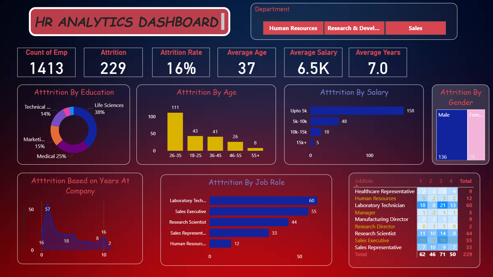
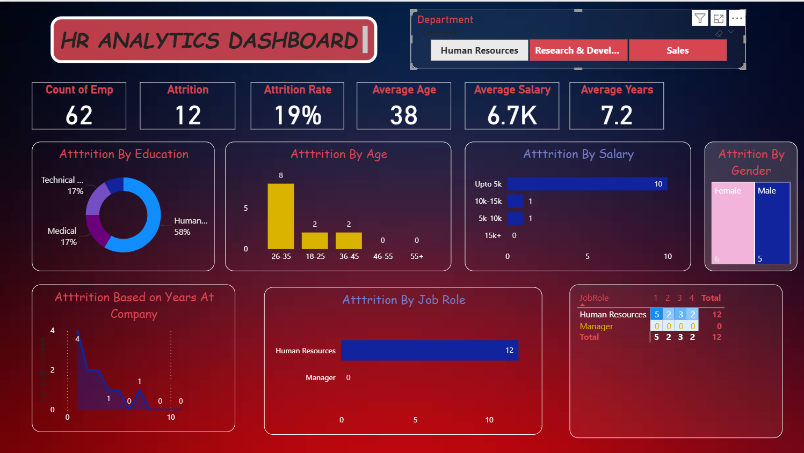
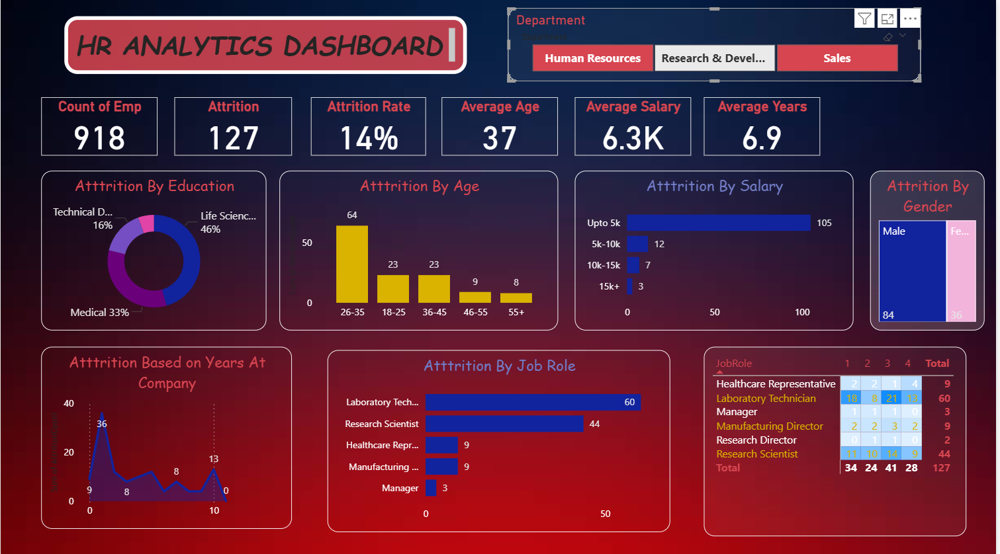
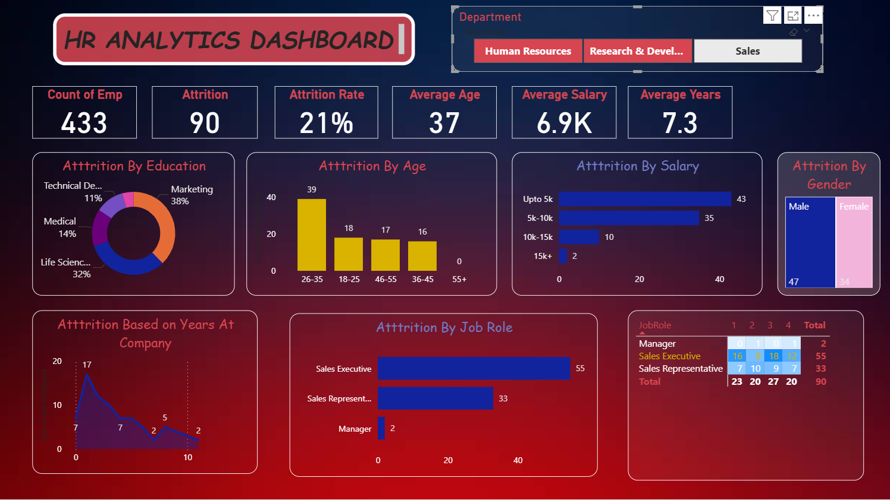

# 📊 HR Analytics Dashboard – Attrition Analysis

## 📌 Project Overview
The **HR Analytics Dashboard** is an interactive data visualization project built using **Power BI** to analyze employee attrition patterns.  
The dataset for this project is sourced from **Kaggle** and focuses on understanding factors influencing employee attrition across various dimensions.

This dashboard helps HR teams and management make **data-driven decisions** to improve employee retention.

---

## 🎯 Objectives
- Analyze **employee attrition rate**
- Identify key factors contributing to attrition
- Enable interactive filtering for deeper insights
- Provide a clear and visual representation of HR metrics

---

## 📂 Dataset
- **Source:** Kaggle (HR Analytics Dataset)
- **Format:** CSV
- **Description:** Contains employee-level information such as age, salary, gender, job role, department, and years at company, etc

---

## 📈 Key KPIs Analyzed
- **Average Age**
- **Average Salary**
- **Attrition Rate**
- **Gender-wise Attrition**
- **Attrition by Job Role**
- **Years at Company vs Attrition**

---

## 🛠️ Technologies Used
- **Power BI Desktop**
- **Power Query** – Data cleaning & transformation
- **DAX (Data Analysis Expressions)** – Calculated measures & KPIs
- **File Format:** `.pbit` (Power BI Template File)

---

## 🔍 Dashboard Features
- Interactive visuals and charts
- **Department-based slicer** for dynamic filtering
- Clear segregation of attrition trends
- User-friendly and executive-level insights
---

## 🧠 Analysis Dimensions
- Attrition by **Age Group**
- Attrition by **Salary Range**
- Attrition by **Gender**
- Attrition by **Years at Company**
- Attrition by **Job Role**

---

## 📸 Dashboard Snapshots

### 🔹 General Dashboard View

### 🔹 HR Department Slicer – View 1

### 🔹 R&D Department Slicer – View 2

### 🔹 SalesDepartment Slicer – View 3

> 📌 *Note:* Replace the image paths with actual screenshot file names from your repository.

---

## 🚀 How to Use
1. Download the `.pbit` file from the repository
2. Open it using **Power BI Desktop**
3. Load the dataset when prompted
4. Interact with slicers and visuals to explore insights

---

## 🤝 Contributions
Contributions, suggestions, and improvements are welcome.  
Feel free to fork the repository and raise a pull request.

---

⭐ If you find this project useful, don’t forget to **star** the repository!
